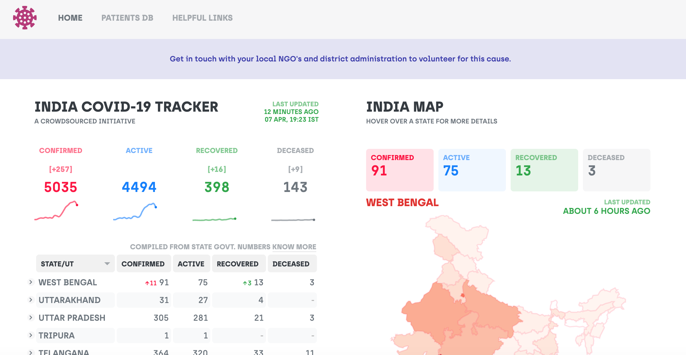

# coronaindia status

<p align="center">

</p>

<p align="center">
  View our <a href="https://bit.ly/patientdb">live patient database</a>.
 </p>

## Setup

```
npm i && npm start
```

## Maintainers

- [fingersfun](https://github.com/fingersfun)

## Contribution

If you're new to contributing to Open Source on Github, [this guide](https://guides.github.com/activities/contributing-to-open-source/) can help you get started. Please check out the contribution guide for more details on how issues and pull requests work..

## License

This source code is licensed under the MIT license.

## Author

<table>
  <tr>
    <td>
      
    </td>
    <td>
      Fingers Fun<br />
      <a href="mailto:kirankumar.mentam@gmail.com">kirankumar.mentamq@gmail.com</a><br />
      <a href="https://fingersfun.com/">https://fingersfun.com/</a>
    </td>
  </tr>
</table>
